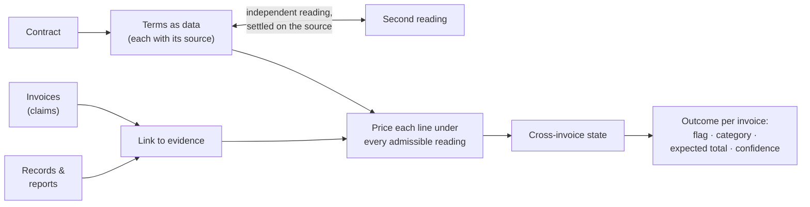

# Contract-Aware Invoice Auditor

[](https://github.com/Nassar-Coding/contract-aware-invoice-auditor/actions/workflows/ci.yml)

**Audits invoices against the contracts that govern them, and says what each answer rests on.**

Billing errors hide in the gap between what a contract says and what an invoice charges:

- a rate superseded by an amendment;
- a discount owed but not applied;
- a quantity beyond what the site record supports;
- a charge billed twice, three invoices apart.

This project reads the contract, links each charge to its evidence and recomputes what should have been billed. For
each invoice it returns:

- whether the invoice is wrong;
- which check it fails;
- the total the contract supports;
- a confidence.

*Python 3.12 · exact `Decimal` / integer-cent arithmetic · contract terms as reviewed JSON/YAML · deterministic replay
with no model calls at runtime · byte-identical reproduction checked in CI.*

The method is applied to two domains, as two separate auditors that share no code:

| | [Hospital claims](hospital-claims/) | [Civil works & drilling](civil-and-drilling/) |
|---|---|---|
| Contracts | 5 hospital reimbursement agreements in Markdown, each structured differently | 2 amended long-running contracts (civil engineering, directional drilling), **scanned PDFs with no text layer** (43 + 42 pages) |
| Invoices | 4,855 invoices across 5 hospitals, with free-text service descriptions | 2,806 invoices with 98,990 lines, evidenced by 2,169 site records and 8,151 daily drilling reports |
| Ground truth | one labelled hospital | **none** |
| Hardest part | which contracted service a free-text description names | reliable terms from scans; state spanning many invoices; facts in documents never supplied |
| Unresolvable invoices | withheld, each with a recorded reason | given an outcome, with the doubt carried in enumerated readings and the confidence |
| Runs in | ~1.5 min, standard library only | ~20 min to reproduce, ~35 min for every gate check |

All data is synthetic and public. Both auditors fetch their input datasets at pinned commits (see
[Provenance](#provenance)).

## Results

**Hospital claims.** Hospital 1 is the only hospital with labels. Its 913 invoices were split by patient group into a
622-invoice *development* partition, used for all tuning, and a 291-invoice *check* partition kept out of tuning.

| Hospital 1 | Development (tuning set) | Check (kept out of tuning) |
|---|---|---|
| Erroneous invoices found | **42 / 42** | **16 / 16** |
| False positives | **0** | **0** |
| Corrected amount exact on true positives | 0.929 | 0.875 |
| Expected calibration error | 0.0332 | 0.0293 |

The development score is in-sample: every threshold was tuned there. The check partition is regression evidence. An
earlier version had already been evaluated on it, so it is not an untouched holdout.

- **Decoys:** none of 184 frozen *decoy proxies* is flagged. These are clean development invoices that carry the
  surface pattern of an error; 122 of them receive an opinion.
- **Perturbation:** with 30% of descriptions perturbed, recall drops by 9.5% relative and no new false positive
  appears.
- **The four unlabelled hospitals:** 2,537 of 3,942 invoices receive an opinion, and 281 of them are flagged. The
  other 1,405 are withheld rather than guessed, each with a recorded reason.

→ [Evaluation](hospital-claims/EVALUATION.md)

**Civil works & drilling.** All 2,806 invoices receive an outcome, and **210 are flagged**: 85 of 900 civil payment
applications and 125 of 1,906 drilling invoices. There are no labels, so correctness was tested against **independent
readings**. Separate LLM reading passes re-read the scanned contracts and computed expected results, and every
difference was settled against the scan:

| Independent check | Agreement |
|---|---|
| Contract tables: blind transcription vs. the transcribed terms | 544 / 547 numeric cells, 1,025 / 1,047 text cells |
| Evidence parsing: blind annotation of sampled records | 646 / 646 civil fields, 1,029 / 1,029 drilling-report fields |
| Line pricing: expected results for 192 reference cases | 858 / 903 comparisons |
| Multi-invoice histories | 28 / 48 readings agree in full; all 59 line-level differences settled |
| Whole invoices | 48 / 50 readings agree on flag and expected total |

**A worked example.** Civil application PA-00297 is flagged *rate* at confidence 0.95:

- Line 7 bills 849 m² of dense bitumen macadam (item D.41.020) at 72.71: the Schedule 1 base rate, 63.50, times the
  1.145 factor for its work zone.
- Supplement No. 1 replaced that base rate with a monthly published rate. For work on 28 November 2025, the last
  published rate (220.50, September) still applies, because Supplement No. 2 only takes over on 1 December.
- The line's contract value is therefore 252.47/m², or 214,347.03.
- With a second rate finding on line 2, the contract supports **359,886.87**, not the 208,403.01 billed.

The same check that catches overbilling found an underbilling.

→ [Error analysis](civil-and-drilling/ERROR_ANALYSIS.md) · [Decision log](civil-and-drilling/DECISION_LOG.md)

Every figure above is listed with the file that records it in [docs/RESULTS.md](docs/RESULTS.md), together with the
command that recomputes it.

## How it works

Both auditors follow the same three steps:

1. **The contract becomes source-referenced data.** Every term is checked before use.
2. **A deterministic engine applies it to the evidence** with exact arithmetic.
3. **Every question the documents leave open is carried through to the output.** Nothing is guessed away.



Module maps for both auditors are in [docs/ARCHITECTURE.md](docs/ARCHITECTURE.md).

## Engineering decisions worth a closer look

1. **Refusing a perfect-looking shortcut.** In Hospitals 2–5, 925 billing lines name more than one contracted
   service, and the candidates disagree on whether the line is billed correctly.
   - Every one of them has exactly one candidate whose contracted rate equals the billed rate. That looks like a
     perfect tie-breaker, and it is deliberately not used: on a line whose rate is *wrong*, it would pick the service
     that makes the error disappear.
   - The service matcher never sees a price, and a test asserts it.
   ([evaluation, failure mode 1](hospital-claims/EVALUATION.md#systematic-failure-modes))
2. **Settling an ambiguous clause by how the parties performed it.** Hospital 2 defines a *Service Day* as 07:00–06:59,
   but its records carry no times.
   - Each admissible reading was tested against the hospital's own billing, with the adoption bar fixed in advance: at
     least 98% of relevant lines, and every rival reading strictly lower.
   - The calendar-day reading accounts for 98.23% of lines; the 07:00 envelope accounts for 42.70%.
   - Scored only on the lines it chose to price, the envelope would have "won" at 99.7% by leaving 2,912 lines
     unpriced. The denominator is every relevant line.
   ([details](hospital-claims/EVALUATION.md#settling-an-ambiguous-clause-by-course-of-dealing))
3. **Precision that comes from silence is not precision.** The first version of the hospital auditor found 4 of the
   42 development errors, with no false positives.
   - One clause that could never be observed was suppressing every other check on 1,110 of Hospital 2's 1,125
     invoices.
   - The fix moved the structural checks out of the mapping path. Now an unresolved fact blocks only what depends on
     it, and evidence that is itself the error is always reported.
   - That change alone took development detection from 4 to 26 of 42.
   ([how the engine improved](hospital-claims/EVALUATION.md#how-the-engine-improved))
4. **Reading contracts that exist only as photographs.** The civil and drilling terms were transcribed from 85
   scanned pages.
   - They were checked against independent OCR, a blind transcription and a second visual pass.
   - Every page is assigned to a rule or marked non-operative.
   - A specification check (`tools/verify_spec.py`) fails if any table that feeds pricing is not marked verified at
     its current content.
   ([spec/](civil-and-drilling/spec/), [verification/](civil-and-drilling/verification/))
5. **Every reading, not a favourite one.** The civil and drilling auditor carries two kinds of open question to the
   output.
   - *Contract readings* the text does not settle: each admissible reading is evaluated, and an invoice wrong under
     some and right under others is flagged at confidence 0.50.
   - *Facts held in documents never supplied* (a well's class, a ground class): these are never taken from the
     invoice that bills them. They are enumerated over their admissible values, and the invoice is wrong only if no
     value makes it right.
   - The flag count under the main alternatives is published.
   ([decision log](civil-and-drilling/DECISION_LOG.md))
6. **Proving the checks can fail.**
   - Every exit check for line pricing, cross-invoice state and outcomes (G3–G5) has a negative-control test showing
     it can fail.
   - Each defect found by independent review is run through the corrected code and, as a control, through the code
     that had it, kept as a test fixture.
   - For G4 and G5, the recorded commit order shows the review packets were committed before the readers' expected
     results, and those before the engine.
   ([tests/](civil-and-drilling/tests/), [`tools/verify_g5.py`](civil-and-drilling/tools/verify_g5.py))

## Two domains, one method

What both auditors share:

- contract terms as checked, source-referenced data;
- deterministic replay;
- a line's billed price never deciding what the line is for;
- every reading enumerated.

What the second domain demanded on top:

| | Hospital claims | Civil works & drilling |
|---|---|---|
| Contract input | Markdown text | scanned images, transcribed and independently re-read |
| Measuring correctness | labels on one hospital; decoys; perturbation | no labels: independent readings, negative controls, replayed traces |
| Ambiguity | withhold the invoice unless a pre-stated test settles the reading | an outcome for every invoice; ambiguity carried in enumerated readings and confidence |
| Cross-invoice state | volume discounts, daily caps, cross-invoice repeats | quantity bands, annual footage, daily limits, once-only charges, a retrospective amendment's difference, retention and its release |
| Expected total | corrected total for flagged invoices | every invoice; for drilling: services, the 4% discount above a threshold, then 15% VAT |
| Verification | an independent output validator, a check partition, decoy proxies, perturbation harnesses | gates G0–G7: committed verifiers for G0–G5, a population review (G6), an independent output check (G7) |

## Run it

Requires Python 3.12, git and `make`. Each auditor clones its input dataset from its public home at a pinned commit
on first use.

```bash
make hospital        # fetch inputs, reproduce, confirm audit_results.csv is byte-identical    (~1.5 min)
make hospital-test   # the hospital auditor's 175 tests                                        (~1 min)
make hospital-eval   # score Hospital 1 development; fails unless 42 TP, 0 FN, 0 FP
make setup           # .venv with the civil auditor's pinned dependencies
make civil           # fetch inputs, reproduce, confirm committed outputs unchanged            (~20 min)
make civil-verify    # every civil gate check, reader comparison and test                      (~35 min)
```

[docs/REPRODUCING.md](docs/REPRODUCING.md) lists the commands behind each target, the measured timings, and how to run
each auditor without `make`. CI runs these targets on each push.

## Repository map

| Path | What it holds |
|---|---|
| [`hospital-claims/`](hospital-claims/) | the hospital claims auditor (`src/insurance_audit/`), reviewed contract and mapping records, evaluation inputs, tests, measurement tools |
| [`civil-and-drilling/`](civil-and-drilling/) | the civil works and drilling auditor (`audit/`), contract specification (`spec/`), committed outputs and independent readings of every gate (`verification/`), verifiers (`tools/`), tests |
| [`docs/`](docs/) | architecture, results with their sources, reproduction |
| `Makefile`, `.github/workflows/` | one entry point for both auditors, and CI |

## Development and review assistance

Both auditors were built with AI coding assistants, under the author's direction and review. The contract records
were drafted with LLM assistance and then reviewed against the source text. For the civil and drilling contracts, the
second readings and several independent reviews were separate LLM passes; their outputs and every disagreement's
resolution are kept under `civil-and-drilling/verification/`. Neither auditor calls a model at runtime.

## Limits

- **The hospital auditor's accuracy is measured on Hospital 1 only.** Nothing measures how many of the 281 flags on
  the unlabelled hospitals are right. One known defect is documented: the Hospital 5 facility-multiplier comparison
  never exercised its alternative reading.
- **Confidence is not a calibrated probability on unlabelled data.**
  - The hospital tiers were fitted on Hospital 1 development; the other hospitals receive that value × 0.9, a stated
    judgement.
  - The civil and drilling scale ranks what an answer rests on; it is not a probability. The output uses 0.95, 0.80,
    0.60 and 0.50; a fifth level, 0.30, is defined but unused.
- **The civil and drilling data has no ground truth.** Its false-negative rate is not measured: the independent reader
  sample for it was drawn but never read. The readers are instances of the same model family, so their agreement
  shows reproduction, not correctness.
- **The civil and drilling outcomes rest on stated decisions.**
  - All 1,906 drilling outcomes depend on a well class set by a document that was never supplied.
  - Civil site zone and night working are taken as stated on the invoice line.
  - The flag count under the main alternatives is in [RESULTS.md](docs/RESULTS.md#how-much-the-headline-depends-on-the-decisions).

## Provenance

This project evolved from two earlier repositories, which keep the full development history of each auditor:

- [Nassar-Coding/insurance-invoice](https://github.com/Nassar-Coding/insurance-invoice): the hospital claims auditor;
- [Nassar-Coding/invoice_v2](https://github.com/Nassar-Coding/invoice_v2): the civil works and drilling auditor.

The input datasets are not redistributed. They are fetched from their public repositories at pinned commits:
[majedzahrani3/insurance_auditing](https://github.com/majedzahrani3/insurance_auditing) at `6fee1da` and
[majedzahrani3/invoice-auditing-level-2](https://github.com/majedzahrani3/invoice-auditing-level-2) at `aef4924`.
