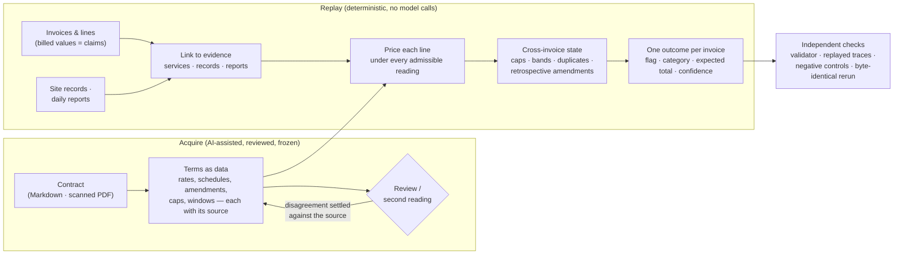

# Architecture

Both auditors answer the same question for every invoice: **is it wrong, why, what should it have totalled, and how
sure is that answer?** They are separate code bases that share no code, but they answer it with the same shape of
system.
The contract becomes reviewed, source-referenced data.
A deterministic engine applies that data to the evidence with exact arithmetic. Every place the documents leave a
question open is carried through to the output instead of being guessed away.

## Principles shared by both auditors

| Principle | Hospital claims | Civil works and drilling |
|---|---|---|
| **Contract terms are data, not generated code** | Finite JSON records per hospital (`contracts/rules_hospital_N.json`, `contracts/hospital_N.json`), each term carrying its source reference, reviewed during implementation (not independently) and frozen; the interpreter allows no expression evaluation | YAML transcriptions of every rate table, schedule and amendment from the scans (`spec/terms_*.yaml`, `spec/instruments.yaml`), with page and provision, each independently second-read; the specification check (`tools/verify_spec.py`) fails if a table that feeds pricing is not marked verified at its current content |
| **Deterministic replay, exact money** | Standard-library Python with no network or model code; staged half-up rounding in integer cents | `Decimal` throughout; the contract's own rounding (half-even where stated); every amount carries a step-by-step trace that `tools/verify_g3.py` replays with its own arithmetic |
| **A line's own bill never decides what it is** | The service matcher never sees a price, so a wrong rate cannot pick the service that hides it; tests assert that mappings do not move when prices are perturbed. (The billed *population* is used, openly, to choose between readings of a clause; see the next row.) | A fact that belongs to a document not supplied (a well's class, a section's nomination, a ground class) is never taken from the invoice that bills it |
| **Ambiguity is enumerated, not guessed** | An ambiguous line is priced under every candidate service; a clause with two readings is settled only by a pre-stated *course-of-dealing* test (≥98% of the hospital's own lines, every rival reading strictly lower), otherwise the invoice is withheld | Every admissible reading of every open question is carried as a scenario; an invoice wrong under some readings and right under others is flagged at confidence 0.50 |
| **Evidence that is itself the error is reported** | An unresolved fact blocks only what depends on it; a malformed date or a duplicate identifier is a finding, not a reason to abstain | Anything unreadable or conflicting is queued as unresolved, never defaulted; a missing required record makes that line non-payable (Cl.46, Cl.37) |
| **Confidence describes the whole row** | Tiers fitted on development so confidence is monotone with accuracy (`evaluation/confidence_policy.json`); the unlabelled hospitals receive the tier value × 0.9, a stated judgement | A fixed ordinal scale by evidence basis, not a probability: 0.95 every check made and the outcome certain; 0.80 rests on a missing document or the Q7 C policy allocation; 0.60 wrong under every reading but the total depends on one; 0.50 readings disagree; 0.30 total cannot be formed |
| **Results are checked by something other than the code that made them** | An output validator independent of the exporter; frozen decoy proxies and perturbation runs (on development); a check partition kept out of tuning | Independent LLM readings compared cell by cell; a negative-control test for every G3–G5 exit check; each defect found by review is run through the code that had it, kept as a test fixture; for G4 and G5, the recorded commit order shows the readings were committed before the engine |

## Hospital claims — module map

`hospital-claims/src/insurance_audit/` (standard library only, Python 3.12):

| Module | Role |
|---|---|
| `io.py` | strict ingestion of the invoice CSVs: billing errors are kept as evidence, malformed values are quarantined, nothing is silently repaired |
| `schema.py`, `resolve.py` | validation of the finite contract records; frozen description-key lookup and selection of the rate version in force on the service date |
| `context.py` | retrospective context across invoices (volume utilisation, daily caps), with explicit lower and upper bounds where evidence is unknown |
| `findings.py` | findings that need no service identity: duplicate and reused identifiers, malformed dates, line arithmetic, service after invoice date, cross-invoice repeats, contract-number and term-window checks |
| `mapping.py` | the four-state service matcher (match / no-match / weak / tie): coverage of the *billed* tokens, an abbreviation lexicon, a contract-vocabulary drift guard and a single-character repair rule |
| `checks.py`, `pricing.py` | line-level contract checks; the fixed pricing order (bundles, multipliers, premiums, uplifts, deepest qualifying discount, caps) in staged half-up cents |
| `audit.py` | per-line decisions under every candidate reading, reconciliation into one invoice opinion, corrected totals, withheld reasons |
| `consistency.py` | the course-of-dealing test that settles an ambiguous pricing stage by the hospital's own billing population |
| `confidence.py` | assigns the frozen confidence tier to each emitted row |
| `batch.py`, `results.py`, `reporting.py`, `pipeline.py`, `__main__.py` | immutable run attempts bound to their decision inputs, export and self-verification, and the `reproduce` / `verify-results` / `evaluate` CLI |
| `evaluation.py`, `inventory.py` | scoring against the Hospital 1 labels, run only by `reproduce --evaluate-development` or the `evaluate` command and never imported by pricing or mapping; label-free input inventories (`inventory` command) |

Measurement tools live outside the runtime in `tools/`: `score_development.py` (detection, precision, amounts and
calibration against the Hospital 1 labels), `validate_results.py` (re-reads the source CSVs, independent of the
exporter), `generalize.py` and `generalize_recall.py` (re-identified, subsampled and perturbed inputs),
`decision_trace.py` (per-invoice decision traces and withheld-reason counts), `mine_decoy_proxies.py`.

## Civil works and drilling — pipeline gates

`civil-and-drilling/` is organised as gates G0–G7, each a stage of the pipeline with its own exit checks. Each gate's
output is committed under `verification/`. G0 and G1 are checked by `tools/snapshot.py verify` and `tools/verify_spec.py`; G2–G5 each have a
verifier, `tools/verify_gN.py`, that recomputes the gate's outputs and fails on any difference.

| Gate | Code | What it establishes |
|---|---|---|
| G0 | `tools/snapshot.py`, `source/` | the inputs: 10,330 files hashed (SHA-256 and git blob), each scanned page's decoded pixels hashed, schemas and joins inventoried |
| G1 | `spec/terms_*.yaml`, `spec/instruments.yaml`, `audit/terms.py`, `tools/verify_spec.py` | the contract terms, transcribed from 85 scanned pages; independent OCR and blind transcription compared cell by cell; every page owned by a rule or marked non-operative |
| G2 | `audit/claims.py`, `records_cw.py`, `records_dds.py`, `events.py`, `links.py`, `build.py` | the evidence: invoice rows as claims with file and line provenance; 2,169 civil site records and 8,151 daily drilling reports parsed; reference validity kept separate from what the record says |
| G3 | `audit/g3_core.py`, `g3_cw.py`, `g3_dds.py`, `g3_run.py` | each line on its own: identity, term, window, record, quantity, unit, rate in force with its build-up and rounding — priced under every admissible input, with a replayable trace |
| G4 | `audit/g4_core.py`, `g4_cw.py`, `g4_dds.py`, `g4_run.py` | state that spans invoices: quantity bands and annual footage, daily limits, duplicates and once-only charges, the retrospective amendment difference and its recipient, retention and its release. G3 results are copied, never modified; every change names its rule, clause and ledger entry |
| G5 | `audit/g5_outcomes.py`, `g5_run.py` | one outcome per invoice: the 12 checks per scenario, the expected total (civil: sum of lines; drilling: services, the DS-900 discount line, net, 15% VAT), flag, categories, confidence |
| G6–G7 | `tools/g6_review.py`, `tools/check_results.py` | population review of rule exposure and outliers; `audit_results.csv` checked independently against the dataset's output template and the inputs |

The register of decisions lives beside the code. Each reading that decides an outcome has its source and its
alternatives in `spec/g3_decisions.yaml`, `spec/g4_state.yaml` and `spec/g5_decisions.yaml`. Questions kept open are in
`spec/open_questions.yaml`. The flag count under each decision's alternatives is computed in
`verification/g5/decision_effects.json`. The exception is civil site zone and night working, which are taken as stated on
the invoice line (G3-D3); their alternatives are not computed per invoice.
